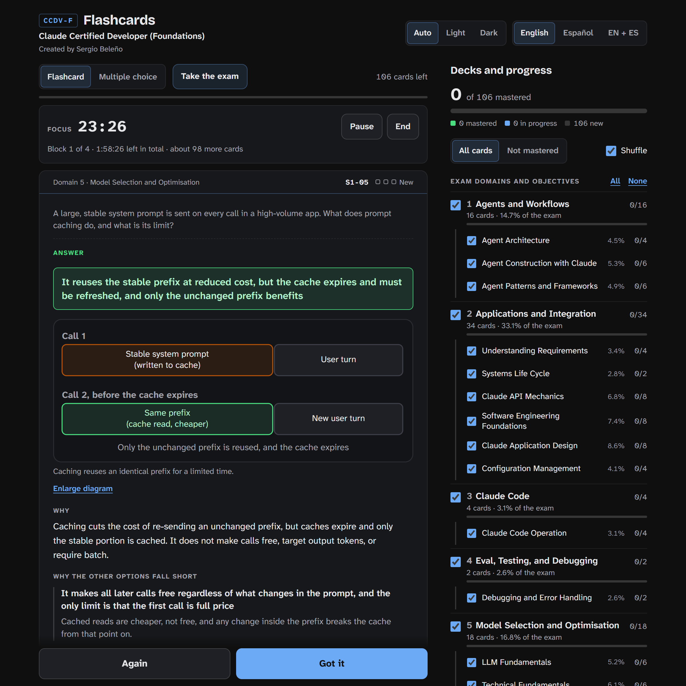

# Claude Certified Developer (Foundations) - Flashcards

**Practice for the Claude Certified Developer (Foundations) exam with
flashcards, multiple-choice drills, and a timed 53-question exam
simulation, all in one self-contained HTML page, in English and Spanish.**

<p>
  
  
  
  
  
</p>




There's nothing to install or build. Open `CCDV-F Flashcards.html` in a
browser and start studying.

> **Unofficial study aid.** This project isn't affiliated with or endorsed
> by Anthropic. The estimated exam score is a guide, not a prediction.

## Contents

- [Features](#features)
- [Getting started](#getting-started)
- [How it works](#how-it-works)
- [Question bank](#question-bank)
- [Study modes](#study-modes)
- [Exam simulation](#exam-simulation)
- [Study timer](#study-timer)
- [Progress and storage](#progress-and-storage)
- [Keyboard shortcuts](#keyboard-shortcuts)
- [Editing the question bank](#editing-the-question-bank)
- [Credits](#credits)

## Features

| Feature | What it does |
|---|---|
| Flashcards | Answer in your head, turn the card, then grade yourself **Again** or **Got it** |
| Multiple choice | Pick an option and get an explanation for the right answer and every wrong one |
| Exam simulation | 53 questions, 120 minutes, no feedback until you submit, estimated score out of 1,000 |
| Mastery tracking | Every card moves through New → Learning → Familiar → Mastered |
| Decks | One deck per exam objective (25), grouped under the 8 exam domains |
| Diagrams | 100 inline SVG diagrams explain the answers, and you can enlarge them |
| Study timer | Plan a session with optional Pomodoro breaks and an estimate of how many cards fit |
| Languages | English, Spanish, or both side by side (`EN + ES`) |
| Themes | Auto (follows the system), Light, or Dark |
| Sync | Saves to the browser, or to your Claude account when the page runs as a Claude Artifact |

## Getting started

```bash
git clone <this-repo>
cd CCDV-F
start "" "CCDV-F Flashcards.html"     # Windows
open "CCDV-F Flashcards.html"         # macOS
xdg-open "CCDV-F Flashcards.html"     # Linux
```

You can also double-click the file. It works offline, apart from the
Google Fonts stylesheet. Without it, the page falls back to system fonts.

## How it works

```text
CCDV-F Flashcards.html
 ├── <style>                          layout, light/dark tokens, reduced-motion rules
 ├── markup                           header, study area, decks panel, dialogs
 ├── <script type="application/json" id="bank">   the question bank (data only)
 └── <script>                         app logic: decks, grading, exam, timer, storage, i18n
```

- **One file, no build step.** All CSS, JavaScript, data, and diagrams are
  inline. The only external request is for fonts.
- **Data and code are separate.** The question bank is a JSON block that
  the script parses at load time, so you can edit questions without
  touching the logic.
- **Every string is bilingual.** Interface text lives in the `T.en` and
  `T.es` tables. Bank entries store text as `["English", "Español"]` pairs.

## Question bank

The bank holds **106 questions**, twice each domain's share of the 53 exam
questions, so the proportions match the exam guide.

| # | Domain | Weight | Objectives | Bank | Per exam |
|---|---|---|---|---|---|
| 1 | Agents and Workflows | 14.7% | 3 | 16 | 8 |
| 2 | Applications and Integration | 33.1% | 6 | 34 | 17 |
| 3 | Claude Code | 3.1% | 1 | 4 | 2 |
| 4 | Eval, Testing, and Debugging | 2.6% | 1 | 2 | 1 |
| 5 | Model Selection and Optimisation | 16.8% | 4 | 18 | 9 |
| 6 | Prompt and Context Engineering | 11.0% | 3 | 12 | 6 |
| 7 | Security and Safety | 8.1% | 4 | 8 | 4 |
| 8 | Tools and MCPs | 10.6% | 3 | 12 | 6 |
| | **Total** | **100%** | **25** | **106** | **53** |

Where the questions come from:

| Source | Count | Notes |
|---|---|---|
| Cheat sheet | 46 | Written from study material |
| Practice sets | 50 | Written from practice material |
| Written for this page | 7 | New questions to fill gaps in coverage |
| From memory of the exam | 3 | Marked on the card. They aren't the exam's wording |

## Study modes

- **Flashcard.** Read the question, answer in your head, and turn the card.
  Grade yourself **Got it** to move the card up one level, or **Again** to
  send it back to *Learning*. A missed card comes back within the next few
  cards.
- **Multiple choice.** Choose an option (or two, when the card says so)
  and press **Check**. The card explains why the right answer is right and
  why each other option falls short.

In the **Decks and progress** panel you can choose decks, show only cards
you haven't mastered, and turn shuffle on or off. When you finish a deck,
you can restudy only the cards you missed.

## Exam simulation

**Take the exam** opens a timed run that's as close to the real exam as the
page can make it:

1. **53 questions** are drawn at random from the 106, using a fixed quota
   per objective. Each attempt gets a new draw in a new order.
2. **120 minutes in one block.** The clock starts when you confirm, and it
   can't be paused. You can hide the clock, but it keeps running.
3. **Multiple choice only, with no feedback while you answer.** You can go
   back, change answers, and flag questions to review.
4. **Decks, flashcards, and the timer are locked** until you submit. The
   exam doesn't change your study progress.
5. **When the time runs out, the exam is submitted for you.** Unanswered
   questions count as wrong.

The result shows how many you got right, a breakdown by domain, the
questions you missed, and an estimated score:

```text
estimated score = 100 + 900 × (correct ÷ 53)        pass mark: 720
```

The official exam reports a scaled score, and its conversion isn't
published. Treat the estimate as a guide only. Past attempts are listed in
the decks panel, and you can clear them without losing study progress.

## Study timer

**Plan your study time** sets a session of 30 min, 1 h, 2 h, or any length
from 5 to 600 minutes.

- **Pomodoro breaks** are on by default: 25 minutes of focus, then a
  5-minute break, with an optional chime.
- **Card estimate.** The page assumes about one minute per card at first,
  then adjusts to your own pace (idle time is ignored).
- **Breaks** open a full-screen rest prompt with a breathing guide. You
  can skip the break or end the timer.

## Progress and storage

| Key (`localStorage`) | Holds |
|---|---|
| `ccdvf:progress:v1` | Each card's level and when you last graded it |
| `ccdvf:settings:v1` | Theme, language, mode, filters, and your measured pace |
| `ccdvf:timer:v1` | The running study timer, so it survives a reload |

When the page is published as a **Claude Artifact**, it also saves progress
to your Claude account through `window.claude` and merges it with the
browser's copy, keeping the newest grade for each card. If the account
isn't available, the page keeps working from the browser's copy.

**Reset progress** erases the levels for every card, both locally and in
the account.

## Keyboard shortcuts

| Context | Key | Action |
|---|---|---|
| Study | `Space` | Turn the card |
| Study | `1` | Again |
| Study | `2` | Got it |
| Study / Exam | `A`, `B`, `C`… | Pick an option |
| Exam | `←` `→` | Previous / next question |
| Exam | `F` | Flag the question |
| Dialogs | `Esc` | Close |

## Editing the question bank

The bank is the `<script type="application/json" id="bank">` block. Its
top-level keys:

| Key | Contents |
|---|---|
| `domains` | `d`, `name` `[en, es]`, `w` (exam weight) |
| `objectives` | `k`, `d` (domain), `name` `[en, es]`, `w` |
| `cards` | `id`, `d`, `ob` (objective), `q` `[en, es]`, `o` (options as `[en, es]` pairs), `a` (correct option indexes), `x` and `w` (explanations), `dia` (diagram), `src` |
| `dias` | Inline SVG diagrams, keyed by the id that a card's `dia` names |
| `exam` | `minutes`, `pass`, and `quota` (questions per objective) |
| `params`, `code` | API-parameter and code walk-through cards (empty in this build) |

After an edit:

- **Keep the quota in step with the bank.** The `exam.quota` values must
  add up to the exam length (53), and each objective needs at least as
  many cards as its quota.
- **Write both languages.** Every text field needs an English and a
  Spanish entry.
- **Use `a` with two indexes for "choose two" questions.** The card and
  the exam rules pick this up on their own.
- **Check the JSON.** A syntax error stops the whole page from loading, so
  open it in a browser and watch the console.

## Credits

Created by **Sergio Beleño**. An unofficial study aid for the Claude
Certified Developer (Foundations) exam.

